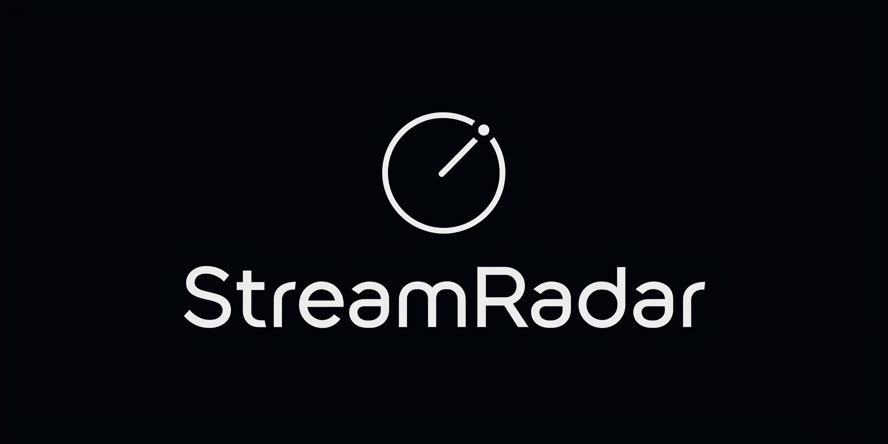

<p align="center">
  
</p>

<p align="center">A self-hosted dashboard for monitoring Twitch streams. Track categories and channels, filter by language and viewers, get alerts via email, Discord or webhooks.

Free, open source, runs on your own computer or server.</p>

<p align="center">
  
</p>

## Why

Twitch lets you follow categories, but it won't notify you when a new stream goes live in one. There's no way to say "tell me when someone starts streaming this game in English with more than 50 viewers." You're left refreshing the category page manually and scrolling through hundreds of streams.

StreamRadar watches the categories and channels you pick, checks for new streams automatically, and alerts you via email, Discord, or any webhook when something matches your conditions — language, viewer count, keywords, you name it. Self-hosted, private, no account needed.

## What it does

- **Track categories** — follow Twitch game categories (e.g. "Just Chatting", "Fortnite")
- **Track channels** — follow specific Twitch channels regardless of what they stream
- **Live dashboard** — see all live streams in one place with sorting, grouping, and filtering
- **Alerts** — get notified when streams go live via email, Discord webhook, or generic webhook
- **Blacklist** — block channels, keywords, or tags from appearing in results
- **Dark / Light mode** — system-aware theme with manual toggle
- **Pin streams** — pin your favorites to the top
- **Export / Import** — backup and restore all your settings
- **Self-hosted** — your data stays on your machine, SQLite database, no external services required

---

## Installation

### Quick install (recommended)

You only need [Docker Desktop](https://www.docker.com/products/docker-desktop/) installed. The install script does everything else.

**Windows** — open PowerShell or Command Prompt and paste:
```
curl -fsSL https://raw.githubusercontent.com/your-user/streamradar/main/install.bat -o install.bat && install.bat
```

Or [download install.bat](https://raw.githubusercontent.com/your-user/streamradar/main/install.bat) and double-click it.

**Mac / Linux** — open Terminal and paste:
```bash
curl -fsSL https://raw.githubusercontent.com/your-user/streamradar/main/install.sh | bash
```

That's it. Open **http://localhost:8080** in your browser.

### Manual Docker install

If you prefer to do it yourself:

```bash
git clone https://github.com/your-user/streamradar.git
cd streamradar
docker compose up -d
```

Everything is automatic — database, encryption keys, and migrations are set up on first launch.

**Change the port** (e.g. to 3000): `APP_PORT=3000 docker compose up -d`

**Stop:** `docker compose stop`

**Update:** `git pull && docker compose up -d --build`

---

### Option 2: Manual installation

Requirements: PHP 8.3+, Composer, Node.js 20+, npm

```bash
git clone https://github.com/your-user/streamradar.git
cd streamradar

# Install dependencies
composer install
npm install

# Build the frontend
npm run build

# Set up the app
cp .env.example .env
php artisan key:generate
php artisan app:setup

# Start the server
php artisan serve
```

Open **http://localhost:8000** in your browser.

For automatic syncing, run this in a separate terminal:
```bash
php artisan schedule:work
```

---

## Getting started

### 1. Connect your Twitch account

StreamRadar needs a Twitch API key to fetch stream data. Don't worry — it only reads public data, no Twitch login is needed.

1. Go to the [Twitch Developer Console](https://dev.twitch.tv/console)
2. Log in with your Twitch account
3. Click **Register Your Application**
4. Fill in:
   - **Name:** anything (e.g. "StreamRadar")
   - **OAuth Redirect URLs:** `http://localhost` (required but not used)
   - **Category:** Analytics Tool
5. Click **Create**
6. Click **Manage** on your new app
7. Copy the **Client ID**
8. Click **New Secret** and copy the **Client Secret**
9. In StreamRadar, go to **Settings** → paste both values → click **Save**
10. Click **Test Connection** to verify it works

### 2. Track your first category

1. Go to the **Tracking** tab
2. Type a category name (e.g. "Just Chatting")
3. Select from the dropdown and click **Track**
4. StreamRadar will immediately fetch live streams for that category

### 3. Track a specific channel

1. In the **Tracking** tab, switch to **Channels**
2. Type a channel login (e.g. "shroud") and click **Track**
3. Their stream will appear on the dashboard whenever they're live

### 4. Set up alerts (optional)

1. Go to the **Alerts** tab
2. Click **New Alert**
3. Configure what you want to be notified about
4. Choose notification method: Email and/or Discord

For Discord alerts, paste your Discord webhook URL in **Settings** → **Discord**.

---

## Notifications

StreamRadar can send alerts through multiple channels:

| Method | Setup |
|--------|-------|
| **Email** | Settings → Email/SMTP. Works with any SMTP server, Gmail, Mailgun, etc. |
| **Discord** | Settings → Discord. Paste a [webhook URL](https://support.discord.com/hc/en-us/articles/228383668) from your server. |
| **Webhook** | Settings → Webhook. POST JSON to any URL — works with [ntfy.sh](https://ntfy.sh), Zapier, Make, or your own endpoint. |

---

## Automatic syncing

StreamRadar automatically refreshes stream data. The sync frequency is configurable in **Settings** (default: every 5 minutes).

**Docker:** Automatic syncing is built-in, no extra setup needed.

**Manual installation:** Keep `php artisan schedule:work` running in a separate terminal, or add a cron job:
```
* * * * * cd /path/to/streamradar && php artisan schedule:run >> /dev/null 2>&1
```

You can also manually sync anytime by clicking the **Sync** button in the top bar.

---

## Security

By default, StreamRadar has no login — it's designed for personal use on your local network.

To add password protection:
1. Go to **Settings** → **Access Control**
2. Set a username and password
3. Click **Save**

Login will be required in all new browser sessions. To disable it, click **Disable Access Control** or run:
```bash
php artisan auth:reset
```

---

## Backup & Restore

Go to **Settings** → **Backup**:
- **Export** — downloads a JSON file with all your settings, tracked categories, channels, and blacklist rules
- **Import** — upload a previously exported JSON file to restore everything

---

## Tech stack

- **Backend:** Laravel 13, PHP 8.4, SQLite
- **Frontend:** Vue 3, Inertia.js 3, Tailwind CSS v4, TypeScript
- **Icons:** Lucide
- **Deployment:** Docker (nginx + PHP-FPM + scheduler in one container)

## Commands

| Command | Description |
|---------|-------------|
| `php artisan streams:sync` | Manually sync all streams |
| `php artisan app:setup` | Initial setup (migrations + defaults) |
| `php artisan auth:reset` | Remove password protection |
| `php artisan schedule:work` | Start the scheduler (auto-sync) |

## License

MIT — do whatever you want with it.
